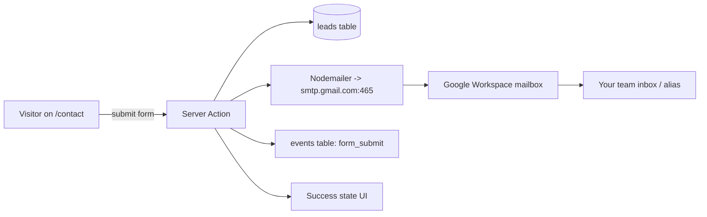

## Tech stack

- **Framework**: Next.js 15 (App Router) + React 19 + TypeScript
- **Styling**: keep the mockup's CSS verbatim in `styles/marketing.css`; Tailwind v4 + shadcn/ui only for the admin dashboard
- **DB / ORM**: Neon Postgres (Vercel Postgres) + Drizzle ORM (`@neondatabase/serverless` HTTP driver — works on Edge & Node)
- **Auth**: Auth.js v5 (`next-auth@beta`) with Credentials provider, bcrypt-hashed passwords, JWT sessions
- **Email**: Nodemailer over Gmail SMTP using your Google Workspace mailbox (e.g. `leads@bookcover.com`). Auth via a 16-char App Password (requires 2-Step Verification on the Workspace user). Connection: `smtp.gmail.com:465` over implicit TLS. SPF + DKIM + DMARC are enabled in the Workspace Admin console for deliverability.
- **Charts**: Recharts (admin dashboard)
- **Tracking**: custom events table + `navigator.sendBeacon`, plus `@vercel/analytics` and `@vercel/speed-insights` running alongside
- **Deploy**: Vercel (one-click from GitHub)

## Repo layout

```
app/
  (marketing)/
    layout.tsx                 # imports marketing.css, mounts <AnalyticsProvider>
    page.tsx                   # landing (port of BookCover_Carrier_v4.html)
    contact/page.tsx           # contact form (port of BookCover_Contact.html)
  (admin)/
    login/page.tsx
    admin/
      layout.tsx               # auth-gated sidebar shell
      page.tsx                 # overview dashboard
      leads/page.tsx
      leads/[id]/page.tsx
      traffic/page.tsx
      engagement/page.tsx
      funnel/page.tsx
      settings/page.tsx
  api/
    track/route.ts             # POST analytics events (sendBeacon target)
    leads/route.ts             # POST lead from contact form (or server action)
    auth/[...nextauth]/route.ts
components/
  marketing/                   # Nav, Hero, Stats, Forces, How, AdminDemo, MemberApp, Engage, Features, Outcomes, Who, CTA, Footer, ContactForm
  admin/                       # KpiCard, AreaChart, BarChart, DataTable, LeadDrawer
  analytics/                   # AnalyticsProvider, useTrackEvent
lib/
  db/{schema.ts, client.ts, migrations/}
  auth.ts
  email.ts
  analytics.ts                 # aggregation SQL helpers
styles/marketing.css           # extracted from the two HTML files, unchanged
middleware.ts                  # protect /admin/*
drizzle.config.ts
.env.example
README.md
```

## Database schema (Drizzle)

- `users` — `id`, `email` (unique), `password_hash`, `name`, `role` ('admin'), `created_at`
- `leads` — every field from the contact form (`first_name`, `last_name`, `title`, `organization`, `email`, `phone`, `lines_of_business jsonb`, `member_count`, `challenge`, `preferred_date`, `preferred_time`, `timezone`, `how_heard`, `alternate_date`, `additional_notes`) + `status` enum (`new` | `contacted` | `qualified` | `disqualified` | `won`), `notes`, `ip`, `user_agent`, `utm_source/medium/campaign`, `referrer`, `visitor_id`, `created_at`, `updated_at`
- `events` — `id`, `visitor_id`, `session_id`, `event_type` enum (`pageview` | `cta_click` | `tab_view` | `scroll_depth` | `form_start` | `form_submit` | `section_view`), `path`, `referrer`, `utm_*`, `country`, `region`, `city`, `device_type`, `browser`, `os`, `properties jsonb`, `occurred_at`
- Indexes on `events(occurred_at)`, `events(event_type, occurred_at)`, `events(visitor_id)`, `leads(created_at)`, `leads(status)`

## Marketing port — preserve the design 1:1

- Move the entire `<style>` blocks from both HTML files into `styles/marketing.css` (consolidated, no rewrite). The `:root` CSS variables and class names stay identical.
- Convert HTML → JSX in small chunks (`Nav`, `Hero`, `StatsStrip`, `ChallengeForces`, `HowWeWork`, `AdminDemo`, `MemberApp`, `EngageSection`, `Features`, `Outcomes`, `WhoWeWorkWith`, `CTA`, `Footer`). React-isms only: `class` → `className`, `for` → `htmlFor`, SVG attrs camelCased (`stroke-width` → `strokeWidth`).
- Replace the imperative tab-switch script (`showAdmin`, `showMC`, `toggleMobileMenu` in `BookCover_Carrier_v4.html` lines 1173–1179) with React `useState` inside `AdminDemo` and `MemberApp` — and fire `cta_click` / `tab_view` analytics events from those handlers.
- Update internal links: `BookCover_Contact.html` → `/contact`.
- Replace the Formspree submission in `BookCover_Contact.html` (line 499 `FORMSPREE_ENDPOINT`) with a server action calling `lib/db` + `lib/email.ts`. Keep the existing success-state UI (lines 391–404).

## Analytics pipeline

Client side (`components/analytics/AnalyticsProvider.tsx`):

- On mount: read/set `bc_vid` (visitor cookie, 2 yr) and `bc_sid` (session cookie, 30-min idle).
- On every route change: fire `pageview` with `path`, `referrer`, parsed UTM params.
- IntersectionObserver fires `scroll_depth` at 25/50/75/100% per page.
- Exposes `useTrackEvent()` hook used by CTA buttons and tab handlers.
- All events POSTed via `navigator.sendBeacon('/api/track', JSON.stringify({...}))` so they never block UX.

Server side (`app/api/track/route.ts`):

- Parses the body, enriches with Vercel's geo headers (`x-vercel-ip-country`, `-region`, `-city`) and `user-agent` (parsed via `ua-parser-js`).
- Inserts into `events` table.

Aggregation (`lib/analytics.ts`):

- Pure SQL helpers (using Drizzle) for: visitors/sessions per day, top pages, top referrers, top countries, device split, conversion funnel (`pageview` → `cta_click` → `form_start` → `form_submit`), avg scroll depth per page, most-clicked admin/member demo tabs.

## Admin dashboard

- `/login` — email + password form, NextAuth Credentials.
- `middleware.ts` protects `/admin/*` (redirect to `/login` if unauthenticated).
- `/admin` — KPI cards (visits today/7d/30d, leads this month, conversion rate, avg scroll depth), area chart of visits last 30d, recent leads list, top referrers.
- `/admin/leads` — filterable table (status, date range, search). Row click opens detail page with full submission, captured tracking context (referrer, UTM, country), status dropdown, and notes textarea.
- `/admin/traffic` — visitors/sessions over time, top pages, top referrers, top countries (with flags), device & browser breakdown.
- `/admin/engagement` — CTA leaderboard ("Contact Our Team" hero vs. footer vs. CTA section), admin-demo tab popularity, member-app tab popularity, scroll-depth distribution.
- `/admin/funnel` — pageview → cta_click → form_start → form_submit conversion, broken down by source/UTM.
- `/admin/settings` — change password, invite additional admin (optional).

## Lead capture flow




Implementation notes for `lib/email.ts`:

- A single shared `nodemailer.createTransport({ host: 'smtp.gmail.com', port: 465, secure: true, auth: { user: GMAIL_USER, pass: GMAIL_APP_PASSWORD } })` cached at module scope (Vercel reuses warm Lambda instances, avoiding repeated handshakes).
- Two emails sent per submission: (1) a rich HTML notification to `LEAD_NOTIFICATION_EMAIL` with the full form payload + tracking context, and (2) an optional auto-reply to the lead from the same Workspace mailbox confirming receipt.
- `from` is set to `"BookCover <GMAIL_USER>"` so DKIM aligns with the Workspace domain. `replyTo` is set to the lead's email on the notification message, so hitting "Reply" in Gmail goes straight to the prospect.
- Send is wrapped in `try/catch` — DB insert always commits even if SMTP fails, so leads are never lost; failures are logged and surfaced in `/admin/settings` as a "Last email error" indicator.

## Deployment to Vercel

1. `git init` + push to a new GitHub repo.
2. Import the repo in Vercel.
3. Add **Vercel Postgres** (Neon) — auto-injects `DATABASE_URL` / `POSTGRES_*` env vars.
4. Set env vars: `AUTH_SECRET` (`openssl rand -base64 32`), `AUTH_URL`, `GMAIL_USER`, `GMAIL_APP_PASSWORD`, `LEAD_NOTIFICATION_EMAIL`, `ADMIN_SEED_EMAIL`, `ADMIN_SEED_PASSWORD`.
5. First deploy runs `drizzle-kit push` (schema sync) + `tsx scripts/seed-admin.ts` via a `postbuild` script — creates the schema and seeds the admin user once.
6. Site live at `<project>.vercel.app`; admin at `/login`.

## Env vars (`.env.example`)

```
DATABASE_URL=
AUTH_SECRET=
AUTH_URL=http://localhost:3000

# Gmail SMTP (Google Workspace)
# GMAIL_USER must be a real Workspace mailbox (e.g. leads@bookcover.com).
# GMAIL_APP_PASSWORD is a 16-char App Password generated at
#   https://myaccount.google.com/apppasswords  (requires 2-Step Verification on the user).
# In Google Workspace Admin -> Apps -> Google Workspace -> Gmail -> User settings,
#   "Less secure apps" must NOT be blocked for SMTP App Passwords to work.
GMAIL_USER=leads@yourdomain.com
GMAIL_APP_PASSWORD=xxxxxxxxxxxxxxxx
LEAD_NOTIFICATION_EMAIL=you@yourdomain.com

ADMIN_SEED_EMAIL=admin@yourdomain.com
ADMIN_SEED_PASSWORD=change-me-on-first-login
```

### One-time Google Workspace setup

1. In Google Workspace Admin, create or pick a mailbox you want emails to be sent **from** (a dedicated alias like `leads@yourdomain.com` is recommended over a personal account).
2. Sign in to that account and enable **2-Step Verification** at [https://myaccount.google.com/security](https://myaccount.google.com/security).
3. Generate an **App Password** at [https://myaccount.google.com/apppasswords](https://myaccount.google.com/apppasswords) (App = "Mail", Device = "Other: BookCover Vercel"). Copy the 16-char value into `GMAIL_APP_PASSWORD`.
4. Confirm SPF/DKIM/DMARC are set up for the domain in Workspace Admin -> Apps -> Gmail -> Authenticate email (one-time, ensures messages from the Vercel app land in inboxes, not spam).
5. Daily send limit on Gmail SMTP through Workspace is ~2,000 messages/day per user — far above what a contact form will ever need. If you ever exceed it, swap `lib/email.ts` to Google Workspace SMTP relay (`smtp-relay.gmail.com`) which raises the cap to 10,000/day; no other code changes required.

## Things I will NOT do (to keep scope tight)

- Won't restyle the marketing pages — pixel-identical to the mockup.
- Won't add a CMS — copy lives in JSX (you can edit and redeploy).
- Won't ship rate-limiting or captcha for the contact form yet — easy follow-up if spam appears.
- Won't add multi-tenancy — single org, single admin (you can add more from `/admin/settings`).

